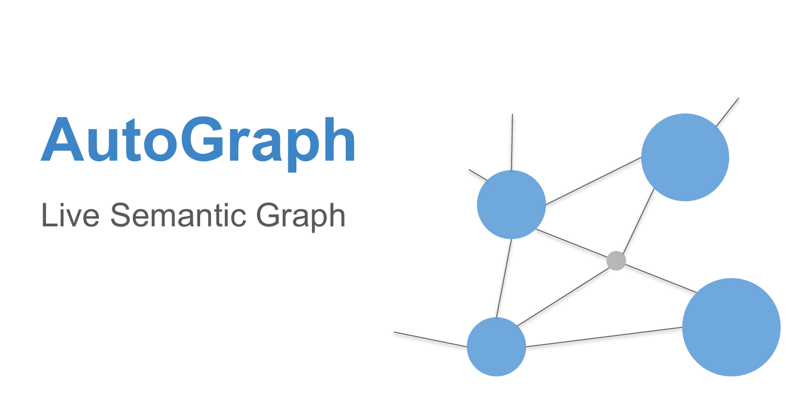
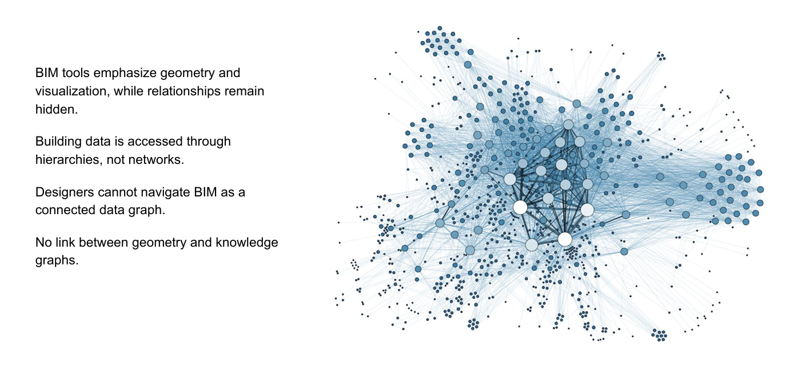
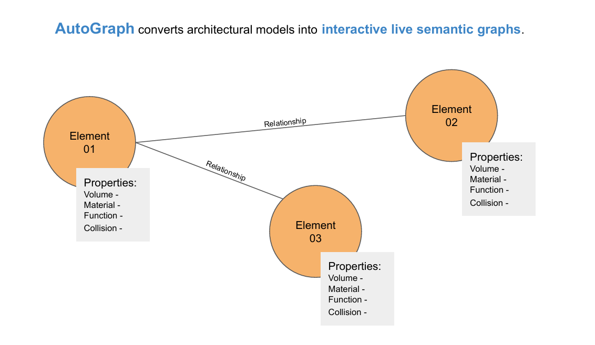
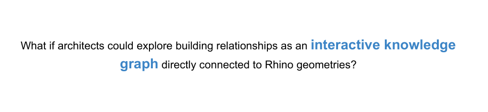
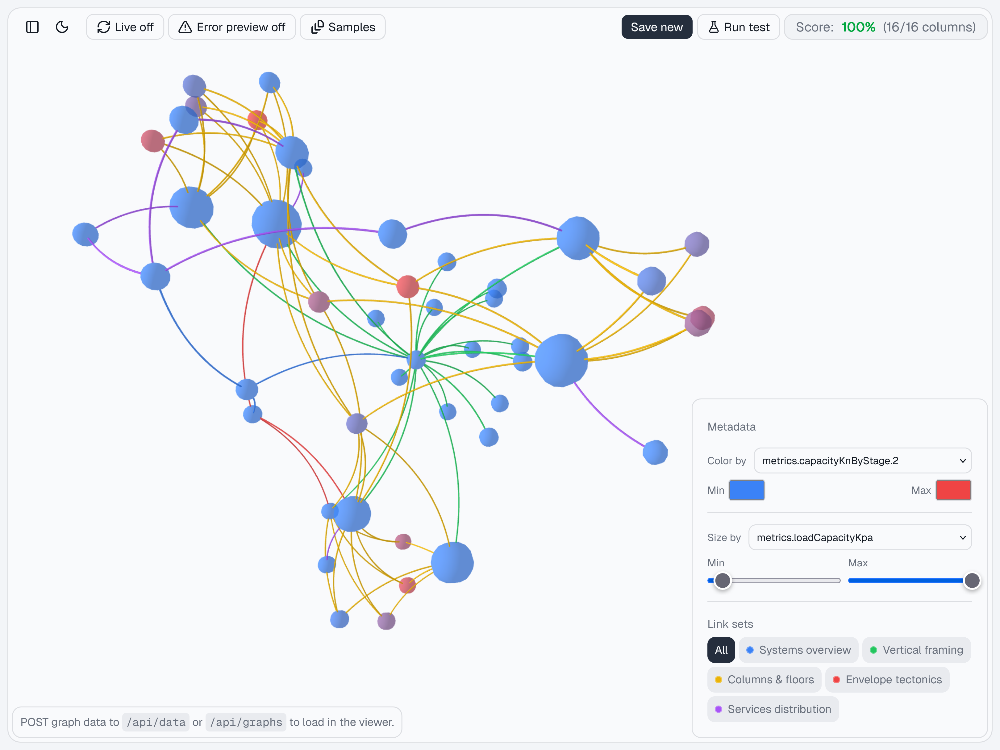
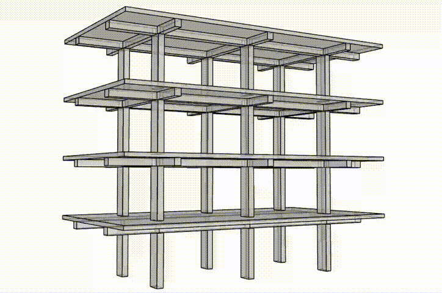
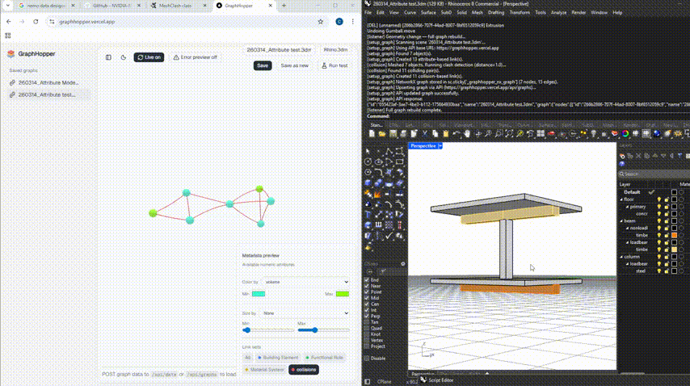
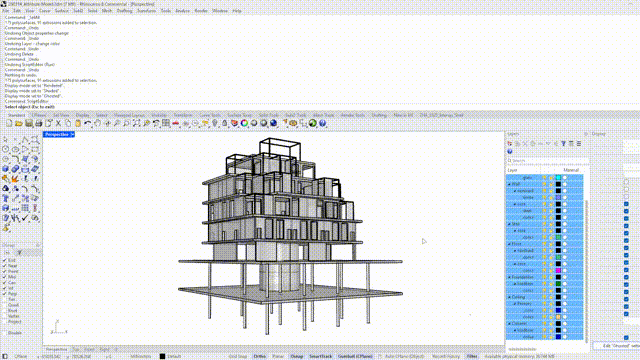
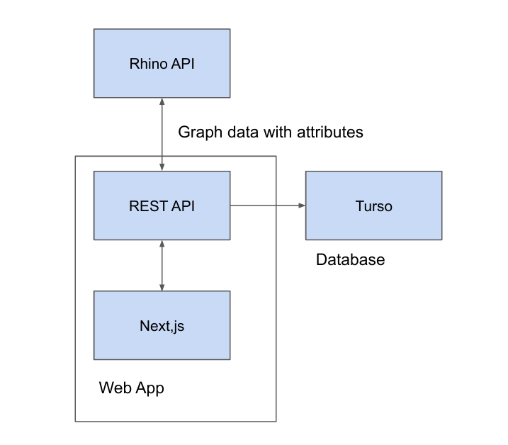

# AutoGraph


Winner of Best Overall Hack at the AEC Tech 2026 Hackathon, this project enables the automated generation of analysis graphs from Rhinoceros 3D architectural models and the visualisation though a cutom web application.


<div>
  
  
  
  
  
  
  
  
  
</div>

## Contributors

Special thanks to all the hackathon project contributors, withouth wich this would not have been possible:

- [Paul-Andrei Burghelea](https://www.linkedin.com/in/paburghelea) — Foster + Partners
- [Christoph Geiger](https://www.linkedin.com/in/christoph-geiger-08b673221/) — Zaha Hadid Architects
- [Jayanaveenaa Periyasamy](https://www.linkedin.com/in/jayanaveenaa-periyasamy/) — Zaha Hadid Architects
- [Anni Dai](https://www.linkedin.com/in/anni-dai12) — Heatherwick Studio
- [Elena Petrova](https://www.linkedin.com/in/elena-petrova-2b0159145/) — Foster + Partners
- [Shivangi Panchal](https://www.linkedin.com/in/shivangi-panchal-a3452b243) — AA EmTech MArch

## Concept


This project models relationships between architectural elements in Rhino as a graph of interconnected nodes and edges. It captures rich metadata that can be used to visualise the graph and analyse weighted relationships across a range of architectural use cases.


---

---



*Example web application that you can test from here: [Link](https://paburghelea.github.io/autograph/)*

<br/>



*Computing the spatial connections as a network* — Shows how nodes and links are generated from the Rhinoceros 3D model.

<br/>



Video shows the live link feature, that regenerates the grph based on live changes in the model. This specific graph is the geometric connectivity graph usefull for clash detection.

<br/>



A feedback loop was considered essential, so we implemented a script that evaluates graph results from the web app and identifies elements that do not meet the defined criteria.


## Features

- **3D graph viewer** — Interactive force-directed graph using Three.js and `react-force-graph-3d`
- **Graph files** — Save, load, duplicate, and delete named graphs; list all saved files in a sidebar
- **Rhino integration** — Attach and download Rhino `.3dm` files per graph
- **Metadata styling** — Color nodes and links by numeric attributes (e.g. `uValue`, `level`)
- **Node details** — Click a node to see its attributes in a side panel
- **Column/floor test** — Run a built-in test that applies results to node metadata
- **Live updates** — Optional polling to refresh when the current file changes on the server
- **Error preview** — Toggle to highlight nodes/links with error-related metadata
- **Dark/light theme** — Theme toggle in the UI

## Third Party Libraries

- **Models:** We used models from [SourceCityToolkit_Rhino](https://github.com/SpectraStudios/SourceCityToolkit_Rhino/tree/main), that we modified to show various graph examples
- **Framework:** Next.js 16, React 19
- **3D Graph:** We used [react-force-graph-3d](https://github.com/vasturiano/react-force-graph) to visualise the graph links in the web application
- **State management:** Zustand
- **Database:** Turso (libSQL) via `@libsql/client`
- **UI:** Tailwind CSS, shadcn/ui, Base UI, Lucide icons

## Getting started

### Prerequisites

- Node.js (v18+)
- A [Turso](https://turso.tech/) database (or compatible libSQL endpoint)

### Environment

Create a `.env.local` (or set in your environment):

```env
TURSO_DATABASE_URL=libsql://your-database.turso.io
TURSO_AUTH_TOKEN=your-auth-token
```

### Install and run

```bash
npm install
npm run dev
```

Open [http://localhost:3000](http://localhost:3000).

### Scripts

Monorepo structure. run 'cd apps/next-app' and run the following commands:

| Script          | Description             |
| --------------- | ----------------------- |
| `npm run dev`   | Start dev server        |
| `npm run build` | Production build        |
| `npm run start` | Start production server |

## Data model

- **Graph:** `nodes` (id, name, arbitrary key-value metadata) and `links` (array of link sets; each set has `set`, optional `notes`, and `links` with `source`, `target`, optional `name`, and metadata).
- **Graph file:** A saved record with id, name, graph JSON, optional Rhino file (base64), and timestamps. Stored in Turso in the `graph_files` table.

## API

- `GET /api/graphs` — List all graph files
- `POST /api/graphs` — Create a new graph file (body: `name`, `graph`, optional `rhinoFileBase64`, `rhinoFileName`)
- `GET /api/graphs/[id]` — Get one graph file
- `PATCH /api/graphs/[id]` — Update name, graph, or Rhino attachment
- `DELETE /api/graphs/[id]` — Delete a graph file
- `GET /api/graphs/[id]/rhino` — Download the attached Rhino file

## Web app project structure (high level)


*Web application architecture*

```txt
src/
├── app/           # Next.js app router (page, layout, api routes)
├── components/    # GraphViewer, MetadataStylePanel, NodeDetailPanel, UI
├── lib/           # store (Turso CRUD), db client, metadata helpers, column-floor-test
├── store/         # Zustand use-graph-store
└── types/         # graph.ts (GraphNode, GraphLink, GraphData, GraphFile, API payloads)
```
*Next app folder structure*
